  

---

### 👩‍💻 Quem sou eu

**Maria Clara** — estudante de **Engenharia de Software** na **UFC**

Tenho foco e interesse em **desenvolvimento web** e **cybersegurança** 🔐 — porque todo mundo gosta de construir castelos, mas eu também gosto de garantir que ninguém derruba o meu.

)

### 📚 Projetos em destaque

| Projeto | Descrição | Stack |
|---|---|---|
| [**Caderno de Leituras**](https://github.com/mariaaclarab/caderno-de-leituras) | Blog de reviews de livros com modal de leitura e busca em tempo real. Primeiro projeto de Desenvolvimento Web — deu trabalho, deu orgulho. | HTML · CSS · JS puro |
| [**Livraria with MySQL**](https://github.com/israellevyzz/livraria_with_MySQL) | Sistema de catálogo e troca de livros — projeto da cadeira de **Requisitos de Software**, em parceria com o Levy. | HTML · CSS · PHP · MySQL |

### 🔭 Atualmente

- 🔐 Estudando **cybersegurança**
- 🖥️ Aprofundando em **React** e desenvolvimento web

### 🎓 Linguagens que já me dominaram

`C` `Python` `Java` `JavaScript` `HTML` `CSS` `React`

### 📫 Onde me encontrar

- 💌 [cadernodeleiturasblog@gmail.com](mailto:cadernodeleiturasblog@gmail.com)
- 🐙 GitHub: você já está aqui 😉

---

*Feito com 💖, café ☕ e pelo menos um gato no teclado 🐈*

